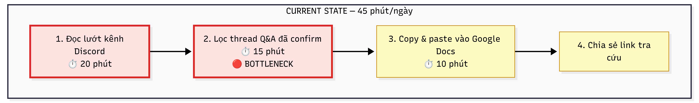
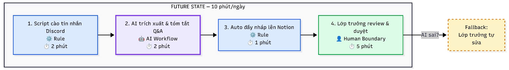

# 02 — Group Problem Statement

## Group convergence
Dưới đây là các nhóm chính (clusters):

| Cluster | Candidate examples | Pattern chung |
|---|---|---|
| Cào & Tổng hợp thông tin | Tổng hợp Q&A Discord, Tổng hợp yêu cầu bài lab | Gom thông tin tản mạn từ các kênh chat/docs rồi cấu trúc lại thành tài liệu lưu trữ |
| Trợ lý khơi gợi (Prompting) | Hỗ trợ học viên đặt câu hỏi | Đặt câu hỏi gợi mở để giúp người dùng tự làm rõ vấn đề đang gặp phải |
| Review / Feedback | Review Pull Request | Đọc hiểu logic (code/nháp) và đưa ra nhận xét, đánh giá chất lượng |
| Phân tích & Dự đoán | Dự đoán nguyên liệu cho quán ăn | Phân tích số liệu lịch sử để đưa ra con số ước tính cho tương lai |

## Shortlist và score

| Candidate | Actor rõ | Workflow rõ | Pain có evidence | Impact đo được | Làm trong lab | So sánh R/W/A được | Nhóm hiểu domain | Tổng |
|---|---:|---:|---:|---:|---:|---:|---:|---:|
| Tổng hợp Q&A Discord | 5 | 5 | 5 | 5 | 5 | 5 | 5 | 35 |
| Hỗ trợ đặt câu hỏi | 5 | 4 | 5 | 4 | 4 | 4 | 5 | 31 |
| Tổng hợp yêu cầu bài lab | 5 | 5 | 4 | 4 | 4 | 4 | 4 | 30 |
| Dự đoán nguyên liệu | 5 | 4 | 4 | 4 | 2 | 3 | 3 | 25 |
| Review Pull Request | 4 | 3 | 4 | 3 | 2 | 4 | 4 | 24 |

Nhóm chọn: **Tổng hợp Q&A từ kênh Discord**.

Vì sao chọn:
- Có workflow lặp lại hằng ngày và điểm nghẽn rất rõ (đọc, lọc tin nhắn).
- Baseline thời gian đã được đo đạc cụ thể (45 phút/ngày).
- Tỉ lệ rủi ro thấp (chỉ tóm tắt Q&A, có human boundary).
- Có thể kết hợp rõ ràng giữa Rule (cào tin nhắn) và AI (trích xuất Q&A).
- Giải quyết được trực tiếp "pain" lặp lại câu hỏi của học viên và tốn tài nguyên Mentor.

Vì sao không chọn các bài khác:
- Dự đoán nguyên liệu: Mức độ phức tạp cao, dữ liệu (bảng sale lịch sử, thời tiết...) có thể khó giả lập trong thời gian lab, rủi ro dự đoán sai dẫn tới lỗ vốn (impact tài chính).
- Review Pull Request: Phụ thuộc vào business logic của code, khó kiểm soát chất lượng bằng AI chung chung, khó thống nhất success metric trong thời gian ngắn.

## Quick validation

Nhóm hỏi nhanh các lớp trưởng / mentor / học viên.

| Nguồn | Số người | Tín hiệu xác nhận | Tín hiệu phản bác | Nhóm sửa problem thế nào |
|---|---:|---|---|---|
| Phỏng vấn nhanh Mentor | 2 | Mentor xác nhận học viên hay hỏi lại câu cũ, tốn nhiều công search lại. | Có những câu hỏi không có đáp án rõ ràng mà phải debug 1-1. | AI chỉ lấy những cặp hỏi-đáp mà Mentor đã "thả reaction" (xác nhận) hoặc trả lời dứt điểm. |
| Phỏng vấn lớp trưởng | 2 | Công đoạn copy/paste qua Google Docs siêu nhàm chán và tốn thời gian. | Đôi khi tin nhắn không liên tiếp, bị ngắt quãng bởi người khác chèn vào. | Workflow cần AI có khả năng nhận diện context nguyên thread chứ không chỉ copy 2 tin nhắn liền nhau. |

Insight sau validation:

```text
Cần rule để đánh dấu câu hỏi đã được giải quyết (ví dụ mentor thả emoji ✅). AI không chỉ "copy", mà phải trích xuất tóm tắt toàn bộ thread chat lộn xộn thành 1 cặp Q&A ngắn gọn gọn gàng.
```

## Research giải pháp

Nhóm tìm các hướng đã có sẵn, không giả định phải tự build từ đầu.

| Nguồn / tool / case | Link | Họ giải quyết phần nào? | Điểm mạnh | Khoảng trống / rủi ro | Bài học cho nhóm |
|---|---|---|---|---|---|
| Discord Auto-Thread & Forum channels | https://support.discord.com/ | Chia các topic rành mạch, có tính năng search cơ bản. | Native tool của Discord, dễ dùng. | Người dùng vẫn lười search, lười tạo thread mà chỉ thích chat thẳng vào kênh chung. | Cách mạng thói quen người dùng rất khó, nên dùng bot chạy ngầm xử lý tin nhắn tự nhiên tốt hơn. |
| Slack AI Recap / Summarize | https://slack.com/help/articles/25076892548883-Guide-to-Slack-AI | Tổng hợp thread, tóm tắt kênh. | Nhanh, mượt. | Chỉ có trên Slack (trả phí), Discord chưa có native feature tương đương đủ mạnh. | Có thể dùng API/Bot Discord cào tin và dùng LLM tóm tắt tương tự Slack AI. |
| Mendable AI / Kapa.ai | https://www.kapa.ai/ | Bot tự động đọc tài liệu và trả lời kỹ thuật trên Discord. | Trả lời tự động siêu mạnh dựa trên Knowledge Base. | Cần setup Knowledge Base lớn và phức tạp. | Bắt đầu bằng việc tự động xây dựng Knowledge Base (tổng hợp Q&A lên Notion) trước, thay vì nhào vào làm Bot tự trả lời ngay. |

## Workflow before/after

### Current State — 4 bước, 45 phút/ngày



### Future State — 4 bước, 10 phút/ngày



**Fallback:** AI tóm tắt sai ngữ cảnh → Lớp trưởng tự chỉnh sửa nội dung trên Notion. Hoặc nếu chất lượng quá tệ, lớp trưởng tự copy bằng tay thread đó.

**Bottleneck mới:** Lớp trưởng review lại trên Notion. Bottleneck này chỉ mất 5 phút (so với 35 phút cũ) và đóng vai trò kiểm soát chất lượng cần thiết.

Before/after impact:

| Metric | Trước | Sau kỳ vọng | Ghi chú |
|---|---:|---:|---|
| Tổng thời gian | 45 phút/ngày | Dưới 10 phút/ngày | Target chính |
| Tỷ lệ câu hỏi trùng lặp | Cao (3-4 lần/tuần) | Giảm 80% | Vì có Notion Q&A đẹp, dễ tra cứu |
| Bước thủ công (bottleneck) | 35 phút (đọc/lọc) | 5 phút (review) | Tiết kiệm cực lớn |

## Problem Statement v0

| Field | Nội dung |
|---|---|
| **Actor** | Lớp trưởng hoặc thành viên ban hỗ trợ học thuật. |
| **Workflow** | Cuối mỗi ngày, lướt đọc các kênh chat, lọc thread hỏi đáp, copy và định dạng lưu vào Google Docs, rồi chia sẻ link. |
| **Bottleneck** | Bước 1 & 2 (Đọc và lọc hàng trăm tin nhắn trôi tự do) làm thủ công mất 35 phút. |
| **Impact** | Tốn 45 phút mỗi ngày của lớp trưởng. Học viên khó tra cứu, dẫn tới hay hỏi lặp lại câu cũ, làm tốn tài nguyên Mentor. |
| **Success Metric** | Giảm thời gian tổng hợp Q&A từ 45 phút xuống dưới 10 phút/ngày. Tài liệu cập nhật trước 23h00. Tỷ lệ câu hỏi trùng lặp giảm 80%. |
| **Boundary** | AI chỉ trích xuất từ tin nhắn thật, không tự sáng tác câu trả lời mới, không tự thay mặt Mentor để trả lời học viên, lớp trưởng luôn review. |

## Rule / Workflow / Agent

| Mức | Phương án | Khi nào đủ | Rủi ro | Chọn? |
|---|---|---|---|---|
| **Rule** | Dùng Discord Bot tự lưu tin nhắn mỗi khi user gọi lệnh (vd: !save). | Đủ nếu user có ý thức gọi lệnh. | Học viên và Mentor thường quên gọi lệnh, dẫn tới sót dữ liệu. | Dùng một phần để cào data tự động (API), không dùng làm giải pháp cốt lõi. |
| **Workflow** | Cào tự động theo giờ → AI đọc log và trích xuất cặp Q&A → Đẩy lên Notion → Lớp trưởng review. | Hợp lý, AI thay thế đúng đoạn mệt nhất là đọc/lọc/tóm tắt ngữ cảnh tự nhiên. | AI có thể bắt sai ngữ cảnh nếu hội thoại ngắt quãng nhiều. | **Chọn** |
| **Agent** | Agent tự lượn trong Discord, thấy ai hỏi trùng sẽ tự trả lời, tự bổ sung vào docs. | Khi cần trả lời tức thì để giảm tải mentor ngay lập tức. | Trả lời sai kiến thức chuyên môn, làm học viên hiểu nhầm. Khó quản lý. | Chưa chọn (quá rủi ro cho bước đầu). |

Mức chọn:

```text
Workflow
```

Vì sao:
- Việc cào dữ liệu lên lịch hoàn toàn dùng Rule (API Discord + Cronjob).
- AI chỉ tham gia vào đúng 1 khâu cần NLP: Đọc hiểu thread lộn xộn và tóm tắt thành Question - Answer gọn gàng.
- Có bước Human Boundary (lớp trưởng duyệt trên Notion) nên kiểm soát được rủi ro hallucination.

## Problem Statement v1

| Field | Nội dung |
|---|---|
| **Actor** | Lớp trưởng hoặc thành viên ban hỗ trợ học thuật. |
| **Workflow** | Cào tin nhắn cuối ngày → Trích xuất/Tóm tắt thread → Đẩy lên Notion → Review & Phân phối. |
| **Bottleneck** | Đọc, lọc ngữ cảnh hàng trăm tin nhắn lộn xộn để rút ra cặp Q&A chuẩn (35 phút). |
| **Impact** | Mất 45 phút/ngày của Lớp trưởng. Học viên bị trôi tin nhắn nên hỏi lại, phiền Mentor (3-4 lần/tuần). |
| **Success Metric** | Thời gian tổng hợp giảm xuống dưới 10 phút/ngày. Cập nhật đều đặn mỗi tối. Tỷ lệ câu hỏi trùng lặp giảm 80%. |
| **Boundary** | Lớp trưởng duyệt cuối. AI chỉ tóm tắt câu đã trả lời, không tự chế kiến thức mới. |
| **AI intervention point** | Khâu nhận diện và tóm tắt (Question - Answer Extraction) từ đống raw chat logs thành nội dung có cấu trúc. |
| **Mức chọn** | Workflow: Rule (cào tin) → AI (trích xuất Q&A) → Rule (đẩy Notion) → Human (review). |
| **Rủi ro & người thật kiểm tra** | Rủi ro: AI tóm tắt sai ý nghĩa kỹ thuật của Mentor. Người thật kiểm tra: Lớp trưởng đọc nháp trên Notion trước khi publish cho lớp. |

## Final decision

Decision:

```text
Go
```

Pilot nhỏ nhất:
- Xuất thủ công file chat log của 1 kênh Discord trong 1 tuần (dạng text/json).
- Tạo prompt để AI đọc file log đó và xuất ra Markdown danh sách Q&A.
- Lớp trưởng đánh giá xem AI lọc được bao nhiêu % số lượng câu hỏi thực tế và tóm tắt có chuẩn xác không.

Exit / rollback:
- Nếu AI không thể hiểu được context vì tin nhắn chèn ngang quá lộn xộn (độ chính xác < 50%), quay về giải pháp Non-AI: Bắt buộc dùng Forum Channel/Thread trên Discord.

Decision rationale:
- Baseline rõ (45 phút/ngày). Workflow rõ ràng từng bước.
- Rủi ro AI chế chữ được kiểm soát hoàn toàn nhờ Lớp trưởng review bản nháp.
- Phân tách nhiệm vụ tốt: Máy làm việc lặp lại (cào tin, đẩy Notion), AI làm việc hiểu ngữ cảnh (tóm tắt), Người làm việc chất lượng (kiểm duyệt).

---


